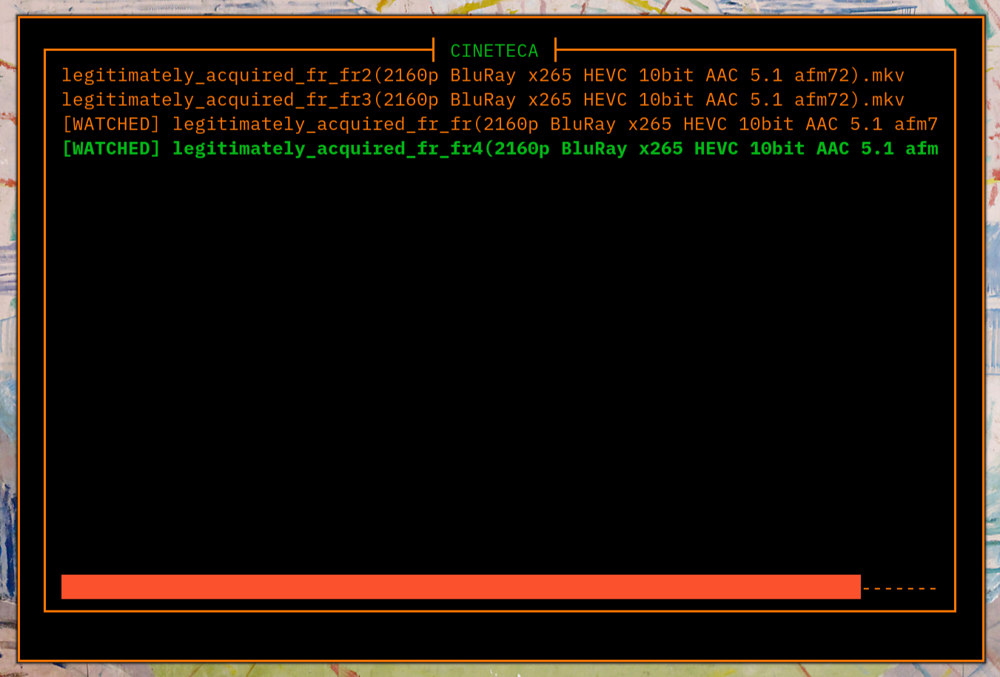

# CINETECA \[WIP\]

TUI movie library to keep track of watched movies in a directory and its subdirectories.



This screenshot shows a library with two movies. One of them is selected, and the other one has been marked as watched.

## How does it work?

The movie library (cineteca) is generated automatically, filtering out files that might not be movies.
This is achieved by recursively reading all the files in the directory and discarding those
that do not have a video extension or are short videos. The program also checks every time
it is opened for changes in the directory, calculating a hash of the directory and comparing
it to the previous one. If there are changes, the library will be updated 
(e.g., if a new movie has been added or removed). 

## Install

Nix users can take advantage of the flake provided in this repo. Add the flake to your
configuration inputs and declare it as a package to install, e.g., by adding it to systemPackages.

```Nix
  inputs = {
    cineteca = {
      url = "github:cch000/cineteca";
      inputs.nixpkgs.follows = "nixpkgs";
    };
  };
```
```Nix
  environment.systemPackages = [
    inputs.cineteca.packages.${pkgs.system}.cineteca
  ];
```

For non-Nix users it is still possible to build the app from source using cargo.

```console
cargo build -r
```
A binary will appear under `./target/release/`. 
Make the program available on your `$PATH`, e.g., by moving it to `/usr/local/bin/`.

## Usage

```console
cineteca /path/to/library #optional, default "."
```

- Press 'w' to mark/unmark as watched 
- Press 'p' to play the movie (requires `mpv`)
- Press '?' to show all keybinds

More options will be added in the future
...
